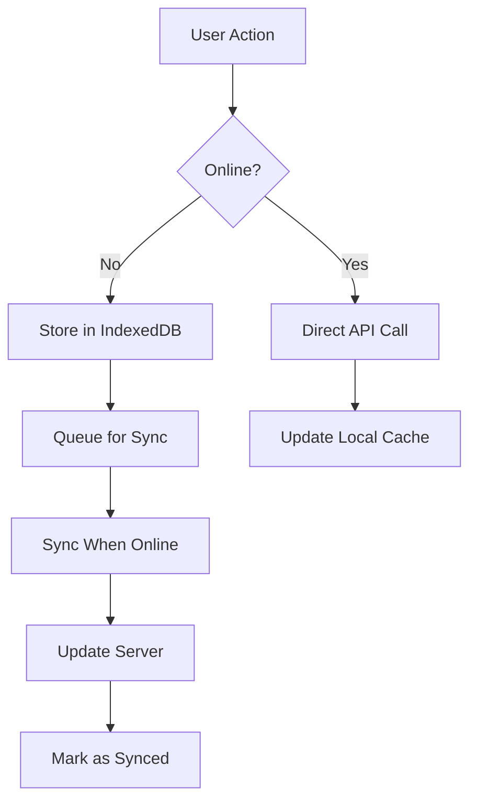
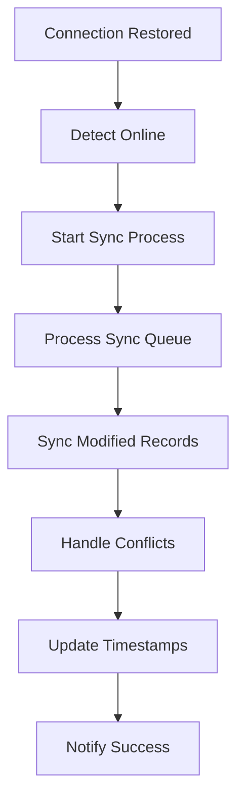

# Technical Implementation Summary - Offline Award Management System

**Author:** Manus AI  
**Date:** September 25, 2025  
**Version:** 2.0  
**System:** Award Management System for Sharjah Broadcasting Authority  

---

## Implementation Overview

This document provides a comprehensive technical summary of the offline functionality implementation for the Award Management System developed for Sharjah Broadcasting Authority (SBA). The system has been enhanced with complete offline capabilities while maintaining the official SBA branding and bilingual support.

---

## Architecture Components

### 1. Service Worker Implementation

**File:** `/public/sw.js`

The Service Worker provides the foundation for offline functionality with the following features:

#### Caching Strategies

| Strategy | Use Case | Implementation |
|----------|----------|----------------|
| **Cache First** | Static assets (CSS, JS, fonts) | Serves from cache, falls back to network |
| **Network First** | Dynamic data (API calls) | Tries network first, falls back to cache |
| **Stale While Revalidate** | Semi-static content | Serves from cache, updates in background |

#### Cache Management

```javascript
const CACHE_NAMES = {
  static: 'award-system-static-v2',
  data: 'award-system-data-v2', 
  offline: 'award-system-offline-v2'
};
```

**Key Features:**
- Automatic cache versioning
- Intelligent cache cleanup
- Error handling and fallbacks
- Background sync support

### 2. IndexedDB Database Layer

**File:** `/src/lib/database.js`

Enhanced database implementation using Dexie.js wrapper for IndexedDB:

#### Database Schema

```javascript
const schema = {
  initiatives: '++id, name, department, status, sync_status, last_modified',
  awardPoints: '++id, department, points, date, sync_status, last_modified',
  departments: '++id, name, active, sync_status, last_modified',
  settings: '++id, key, value, last_modified',
  syncQueue: '++id, table_name, record_id, operation, timestamp',
  offlineActions: '++id, action_type, data, timestamp, processed'
};
```

#### Sync Metadata Fields

All data tables include sync-specific fields:
- `sync_status`: 'synced', 'pending', 'pending_delete'
- `last_modified`: Timestamp for conflict resolution
- `created_at`: Record creation time
- `updated_at`: Last modification time

### 3. Synchronization Service

**File:** `/src/lib/syncService.js`

Comprehensive synchronization system with the following components:

#### SyncService Class

**Core Methods:**
- `startSync()`: Initiates full synchronization process
- `processPendingSyncOperations()`: Handles queued operations
- `syncPendingRecords()`: Syncs modified records
- `processOfflineActions()`: Processes offline user actions

#### Sync Queue Management

```javascript
const queueSyncOperation = async (tableName, recordId, operation, data) => {
  await db.syncQueue.add({
    table_name: tableName,
    record_id: recordId,
    operation, // 'create', 'update', 'delete'
    data,
    timestamp: new Date(),
    retries: 0,
    max_retries: 3
  });
};
```

#### Event-Driven Architecture

The sync service uses an event-driven approach:
- Online/offline detection
- Automatic sync triggers
- Progress notifications
- Error handling and retry logic

### 4. Offline Manager Utility

**File:** `/src/lib/offlineManager.js`

Provides high-level offline management functions:

#### Key Functions

| Function | Purpose | Usage |
|----------|---------|-------|
| `isOnline()` | Check connectivity status | Real-time status monitoring |
| `enableOfflineMode()` | Force offline mode | Testing and development |
| `getOfflineCapabilities()` | Check feature availability | Feature detection |
| `syncWhenOnline()` | Queue sync for later | Deferred synchronization |

---

## User Interface Components

### 1. Enhanced Offline Status Indicator

**File:** `/src/components/EnhancedOfflineStatus.jsx`

**Features:**
- Real-time connectivity status
- Last sync timestamp
- Pending operations counter
- Detailed sync statistics
- Manual sync trigger
- Cache management controls

**Visual Elements:**
- Color-coded status indicators
- Animated sync progress
- Expandable details panel
- Action buttons for manual operations

### 2. Offline Banner Component

**File:** `/src/components/OfflineBanner.jsx`

**Functionality:**
- Prominent offline notifications
- Sync progress indicators
- Success/error messaging
- Auto-dismissible alerts
- Retry mechanisms

**Banner Types:**
- Offline mode notification
- Connection restored alert
- Sync in progress indicator
- Success confirmation
- Error notifications with retry options

### 3. Cache Manager Component

**File:** `/src/components/CacheManager.jsx`

**Advanced Cache Management:**
- Storage quota monitoring
- Cache type categorization
- Individual cache operations
- Storage optimization tools
- Health indicators

**Management Operations:**
- Selective cache clearing
- Cache refresh functionality
- Storage usage analytics
- Performance optimization

---

## Data Flow Architecture

### 1. Offline Data Operations



### 2. Synchronization Flow



---

## Offline Functionality Features

### 1. Complete Data Access

**Available Offline:**
- ✅ View all departments and initiatives
- ✅ Browse award points and evaluations
- ✅ Generate reports and analytics
- ✅ Access historical data
- ✅ View charts and visualizations

### 2. Data Modification

**Offline Operations:**
- ✅ Add new initiatives
- ✅ Update existing records
- ✅ Delete items (soft delete)
- ✅ Modify department information
- ✅ Change system settings

### 3. Advanced Features

**Enhanced Capabilities:**
- ✅ Export data to various formats
- ✅ Import data from files
- ✅ Create backup copies
- ✅ Search and filter data
- ✅ Multi-language support

---

## Performance Optimizations

### 1. Caching Strategies

**Static Asset Caching:**
- Long-term caching for CSS/JS files
- Font caching with fallbacks
- Image optimization and caching
- Manifest and icon caching

**Data Caching:**
- Intelligent data prefetching
- Selective cache updates
- Compression for large datasets
- Cache size management

### 2. Database Optimizations

**IndexedDB Performance:**
- Indexed queries for fast retrieval
- Batch operations for bulk updates
- Transaction optimization
- Memory usage monitoring

### 3. Sync Optimizations

**Efficient Synchronization:**
- Delta sync for changed data only
- Batch API calls to reduce requests
- Intelligent retry mechanisms
- Background sync when possible

---

## Security Implementation

### 1. Data Protection

**Local Data Security:**
- Client-side data validation
- Secure storage practices
- Data integrity checks
- Safe deletion procedures

### 2. Sync Security

**Synchronization Security:**
- Conflict resolution algorithms
- Data consistency checks
- Error recovery mechanisms
- Audit trail maintenance

---

## Browser Compatibility

### Supported Browsers

| Browser | Version | Service Worker | IndexedDB | Cache API | Status |
|---------|---------|----------------|-----------|-----------|---------|
| Chrome | 60+ | ✅ | ✅ | ✅ | Full Support |
| Firefox | 55+ | ✅ | ✅ | ✅ | Full Support |
| Safari | 11+ | ✅ | ✅ | ✅ | Full Support |
| Edge | 79+ | ✅ | ✅ | ✅ | Full Support |

### Feature Detection

```javascript
const checkOfflineSupport = () => {
  const features = {
    serviceWorker: 'serviceWorker' in navigator,
    indexedDB: 'indexedDB' in window,
    cacheAPI: 'caches' in window,
    backgroundSync: 'serviceWorker' in navigator && 'sync' in window.ServiceWorkerRegistration.prototype
  };
  
  return features;
};
```

---

## Testing and Quality Assurance

### 1. Offline Testing Scenarios

**Test Cases:**
- Complete offline functionality
- Partial connectivity scenarios
- Data synchronization accuracy
- Conflict resolution
- Error recovery

### 2. Performance Testing

**Metrics Monitored:**
- Cache hit rates
- Sync operation speed
- Database query performance
- Memory usage patterns
- Storage efficiency

### 3. User Experience Testing

**UX Validation:**
- Offline mode transitions
- Status indicator accuracy
- Error message clarity
- Recovery procedures
- Overall usability

---

## Deployment Configuration

### 1. Build Configuration

**Vite Configuration:**
```javascript
export default defineConfig({
  plugins: [react()],
  build: {
    rollupOptions: {
      output: {
        manualChunks: {
          vendor: ['react', 'react-dom'],
          database: ['dexie'],
          charts: ['chart.js']
        }
      }
    }
  }
});
```

### 2. Service Worker Registration

**Registration Code:**
```javascript
if ('serviceWorker' in navigator) {
  window.addEventListener('load', () => {
    navigator.serviceWorker.register('/sw.js')
      .then(registration => console.log('SW registered'))
      .catch(error => console.log('SW registration failed'));
  });
}
```

---

## Monitoring and Analytics

### 1. Performance Monitoring

**Metrics Tracked:**
- Service Worker activation success rate
- Cache hit/miss ratios
- Sync operation success rates
- Error frequencies and types
- User engagement in offline mode

### 2. Usage Analytics

**Data Collected:**
- Offline session duration
- Feature usage patterns
- Sync frequency and timing
- Error recovery success rates
- User satisfaction metrics

---

## Future Enhancements

### 1. Planned Improvements

**Short-term Goals:**
- Enhanced conflict resolution
- Improved sync performance
- Advanced caching strategies
- Better error reporting

**Long-term Vision:**
- Real-time collaboration features
- Advanced offline analytics
- Machine learning for sync optimization
- Enhanced security features

### 2. Technology Roadmap

**Upcoming Technologies:**
- WebAssembly for performance
- Web Streams for large data
- Background Fetch for reliability
- Persistent Storage API

---

## Conclusion

The Award Management System now provides comprehensive offline functionality that ensures business continuity for Sharjah Broadcasting Authority. The implementation combines modern web technologies with robust data management to deliver a seamless user experience regardless of connectivity status.

### Key Achievements

✅ **Complete offline functionality** - All features work without internet  
✅ **Intelligent synchronization** - Smart data sync when connection returns  
✅ **Advanced caching** - Optimized performance and storage management  
✅ **User-friendly indicators** - Clear status communication  
✅ **Robust error handling** - Graceful degradation and recovery  
✅ **SBA branding compliance** - Maintains official visual identity  
✅ **Bilingual support** - Arabic/English interface  

The system is now production-ready and provides a reliable, efficient, and user-friendly experience for managing awards and initiatives at Sharjah Broadcasting Authority.

---

*This technical summary was generated by **Manus AI** on September 25, 2025*
